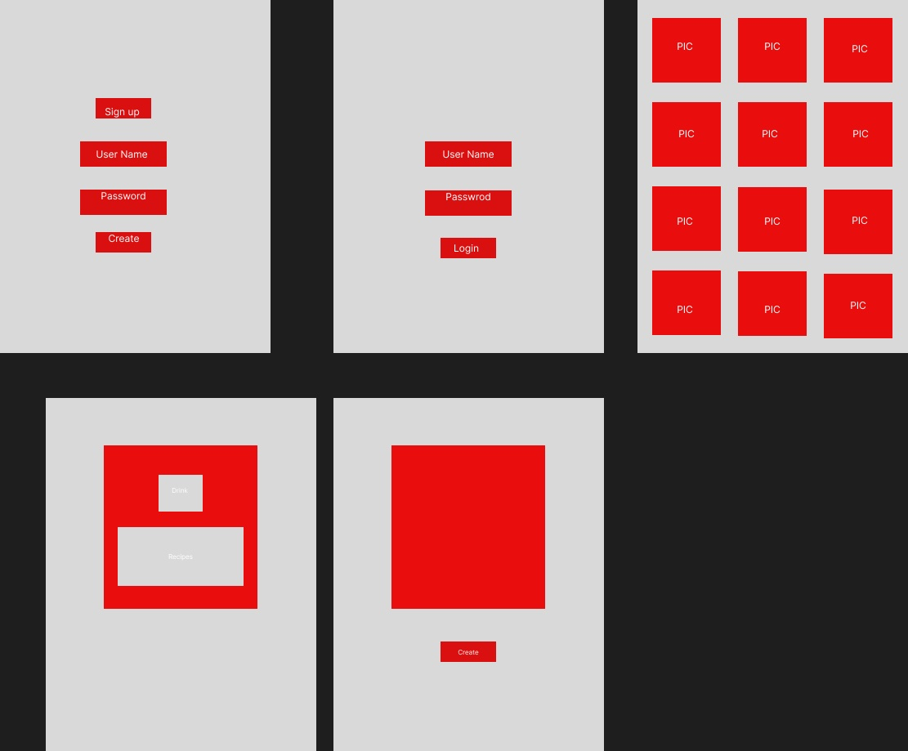
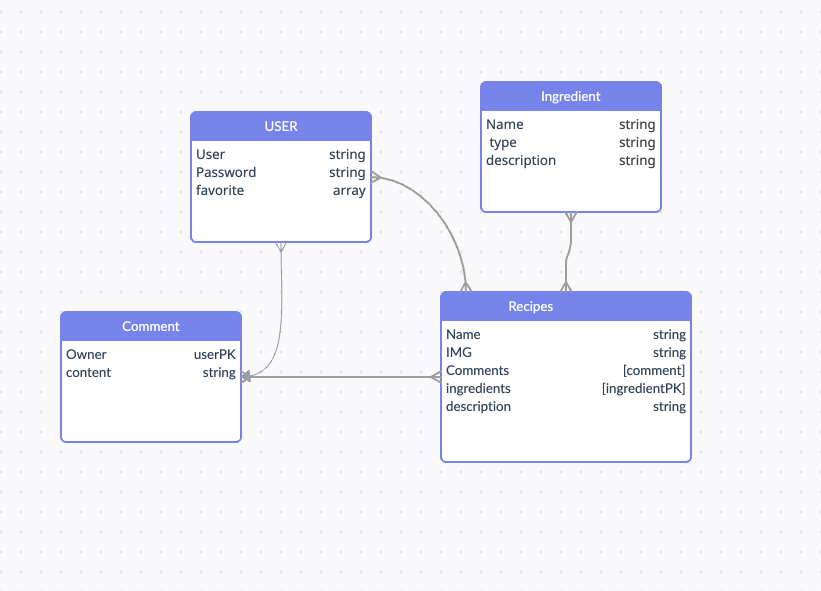

Project 2 Planning.!!!!!!!!!

OVERVIEW:
BOBA DRINKS is a fullstack applicatiopn where it will storged up to more than 10 boba drinks for the users to see. Any User of this website can be able to select and edit their own drinks. Each user will have the ability to create and save their own drinks to their own dashboard or look up the provided recipes from the website to follow and make their own drink.

User Story:

- sign up

- sign in

- save the boba recipes

- comment recipes

- delete recipes

- edit recipes

- detail of recipes

- create recipes

- view your own dashboard 

- list of all recipes

- change password

SCHEDULE

- Monday- setting up all the servers 
- Tuesday- create a list of drinks and ingredients
- Wednesday - work on users
- Thursday - frontend
- Friday review